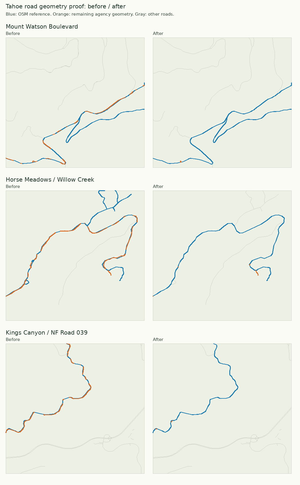

# Tahoe road matching and worker scaling

The implementation uses general matching rules; there are no Tahoe-specific name
or coordinate exceptions. Promoted release: `topo-z12-pilot-20260909-r2`. The live website and Expo default
metadata now point to this release.

## Generation

| Fixture | 8 workers | 16 workers | 24 workers | 32 workers |
|---|---:|---:|---:|---:|
| Earlier 80-parent pipeline | 52.4 s | 47.9–48.3 s | 48.8 s | 53.0 s |
| Optimized 80-parent pipeline, road fixes included | 46.9–47.6 s | 42.1–43.1 s | — | — |
| Optimized 400-parent Sierra fixture | 61.8 s | 49.5 s | 49.3 s | 53.3 s |

Use 16 workers by default. The 24-worker Sierra difference is within normal
variation; 32 workers spend more CPU preparing repeated source context. Spatial
batches of 64 children reduce repeated setup. Independent recreation source cells
now prepare in parallel; outputs preserve their existing order and semantics.
Default DEM rendering uses at most 16 workers, with separate 16-thread acquisition.

The parallel recreation change reproduced all 80 base files and 140 DEM files
byte-for-byte before road changes. Final runs with the road fixes also produced
identical 220 pilot files across worker counts/repeats, and identical 884 Sierra
files across all four worker counts. An attempted geometry-union shortcut was
rejected because it changed component encoding order; the existing geometry
union remains in use.

These are retained-input timings, including regeneration/packing and DEM encoding,
but excluding upload. They do not measure cold nationwide acquisition. Keep the
existing national planning reserve until sustained cold downloads are measured.

Reproduce with `experiments/tahoe/benchmark_workers.py --fixture pilot --workers
8 16 --repeats 2`, or `--fixture sierra --workers 8 16 24 32`, using the tiles venv.
Only bounded experimental output directories are written; nothing is published.

## Road matching

- Normalize common abbreviations: Mt/Mount, Mtn/Mountain, Blvd/Boulevard,
  Sp/Spur and Hwy/Highway, alongside Road/Rd and Trail/Trl.
- Match explicit forest-road references such as NF 73 and 73, preserving numeric
  prefixes, hyphens and spur suffixes. Never infer equivalence from a matching
  numeric suffix, and never treat an inherited agency reference as independent
  OSM evidence.
- Retain OSM geometry. Require compatible road/path types, bridge/tunnel state,
  sustained overlap and agreement in direction; names alone cannot merge roads.
- Where rural road names disagree, at least 100 metres of already-established
  close alignment is required before allowing up to 8 metres of remaining survey
  offset along that same reference. This rule excludes service lanes and does not
  merge merely parallel roads or short shared junctions.
- Explicit agency pavement can change an OSM track to ordinary-road rendering only
  when OSM has no surface evidence and at least 95% of that reference fragment is
  matched. Preserve the original class in source provenance, record
  `class_basis=agency_explicit_pavement`, and retain conflicting/partial evidence.
- Keep unmatched extensions, branches, and all source permissions/provenance.

Examples improved include Mount Watson Boulevard, Jackass Spur, Horse Meadows /
Willow Creek Road, Kings Canyon / National Forest Development Road 039, and
Niehaus Spur / West Miller Creek. The zoom audit found 12 fine-fragment pavement
corrections on Mount Watson Boulevard, Martis Peak Road and Rocky Spur. It also
examined 165 paved coarse fragments from 12 Tahoe overview tiles. A coarse road
may legitimately cover fine segments of several classes; this is not treated as
a reason to flatten every segment to one classification.

## Audit and limitations

The systematic scan covers 40 Tahoe z12 parents / 640 z14 source children.
Flagged nearby road-fragment pairs fell from 239 to 151. These counts are review
signals, not distinct physical roads or a guarantee that every duplicate is gone.
The detector flags >=30 metres and >=70% of the shorter fragment within 15 metres.
Remaining examples include campground loops and service lanes at William Kent,
Camp Richardson and Fallen Leaf. They remain available for individual review;
the pipeline does not erase them simply to make the warning count zero.

Run `experiments/tahoe/audit_roads.py --derived PATH/derived --output REPORT.json`
on any generated shard; optionally pass a JSON z12 parent list with `--parent-file`.
It uses a spatial index and emits review geometry/properties without changing data.
This is the same audit to run on later regional/national shards.

Validation: 25 matching tests, 95 national tile tests and 3 combined-publication
tests pass. Matching tests cover crossings, reverse digitization, bridges,
switchbacks, parallel roads, short junctions, campground lanes, full/partial
pavement, conflicting surfaces and preservation of access/source records.

## Published result

All 352 objects generated, uploaded and remotely checksum-verified in 104.36
seconds (earlier pilot: 162.06 seconds; transfer timing also varies). Fresh and
cached runs of the real mobile queue each downloaded 37 unique base/DEM files
for Tahoe/SF cells and reopened them with networking disabled. Runs took 5.08
and 4.20 seconds; the test uses an in-memory filesystem, not a physical iPhone.
Root metadata was checked after reversible promotion. Reload Expo to fetch it.
